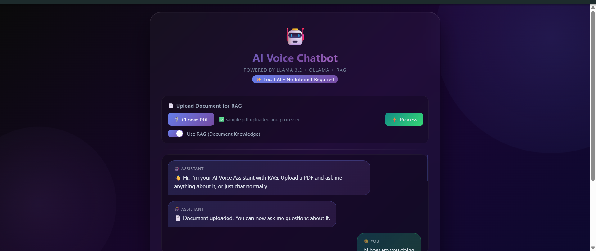
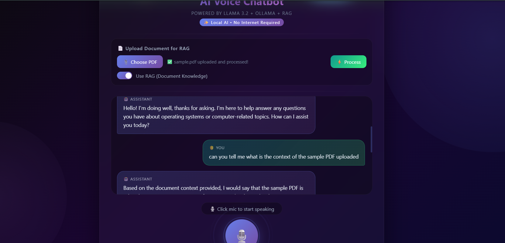

# 🤖 AI Voice Chatbot with RAG Pipeline

A fully functional AI-powered voice chatbot built with Python, Flask, and Llama 3.2. 
Runs **completely offline** — no internet or paid APIs required!







## ✨ Features

- 🎙️ **Voice Input** — Speak naturally using your microphone
- 🔊 **Voice Output** — AI speaks back using text-to-speech
- 📄 **RAG Pipeline** — Upload any PDF and ask questions about it
- 🧠 **Local LLM** — Powered by Llama 3.2 via Ollama (100% offline)
- 💬 **Chat History** — Maintains conversation context
- 🎨 **Beautiful UI** — Modern dark theme web interface
- 🔒 **Privacy First** — All data stays on your machine

## 🛠️ Tech Stack

| Technology | Purpose |
|---|---|
| Python + Flask | Backend server |
| Llama 3.2 (Ollama) | AI Language Model |
| Web Speech API | Voice to text |
| gTTS | Text to voice |
| RAG Pipeline | Document Q&A |
| HTML/CSS/JS | Frontend UI |


## ⚙️ Installation & Setup

### Prerequisites
- Python 3.x
- [Ollama](https://ollama.ai) installed
- Llama 3.2 model pulled

### Step 1 — Clone the repository
```bash
git clone https://github.com/azindra/ai-voice-chatbot.git
cd ai-voice-chatbot
```

### Step 2 — Install dependencies
```bash
pip install flask gtts requests pypdf
```

### Step 3 — Pull Llama 3.2 model
```bash
ollama pull llama3.2
```

### Step 4 — Run the app
```bash
python app.py
```

### Step 5 — Open in browser


## 🎯 How to Use

1. **Normal Chat** — Click mic button and speak
2. **Document Q&A** — Upload a PDF → Click Process → Ask questions about it
3. **Toggle RAG** — Switch between document mode and normal chat mode

## 🔥 Use Cases

- 📚 Ask questions about study materials
- 🏥 Healthcare document assistant (like Prodoc.AI)
- 📋 Resume/document Q&A
- 🤖 General AI voice assistant

## 👨‍💻 Author

**Your Name**
- GitHub: [G ASHIKA ](https://github.com/azindra)
  

## 📄 License
MIT License
